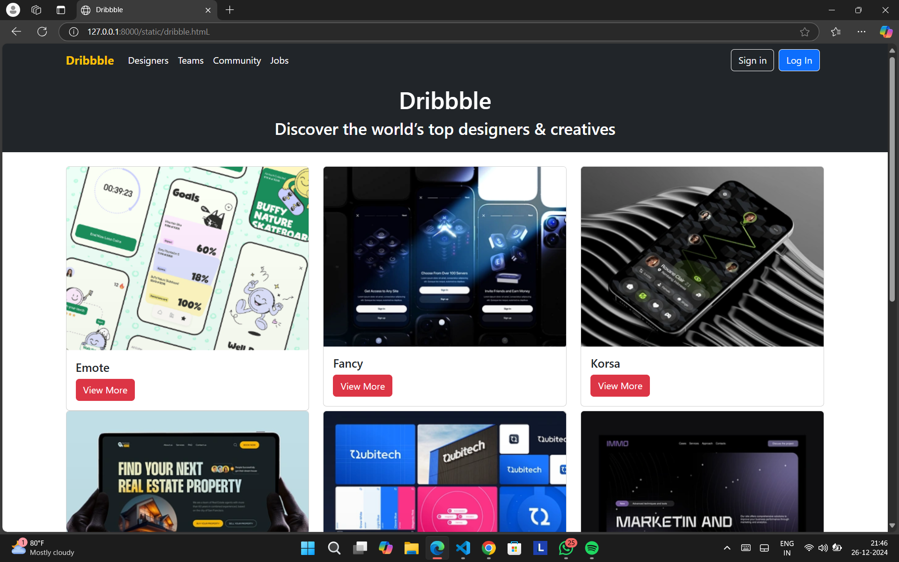
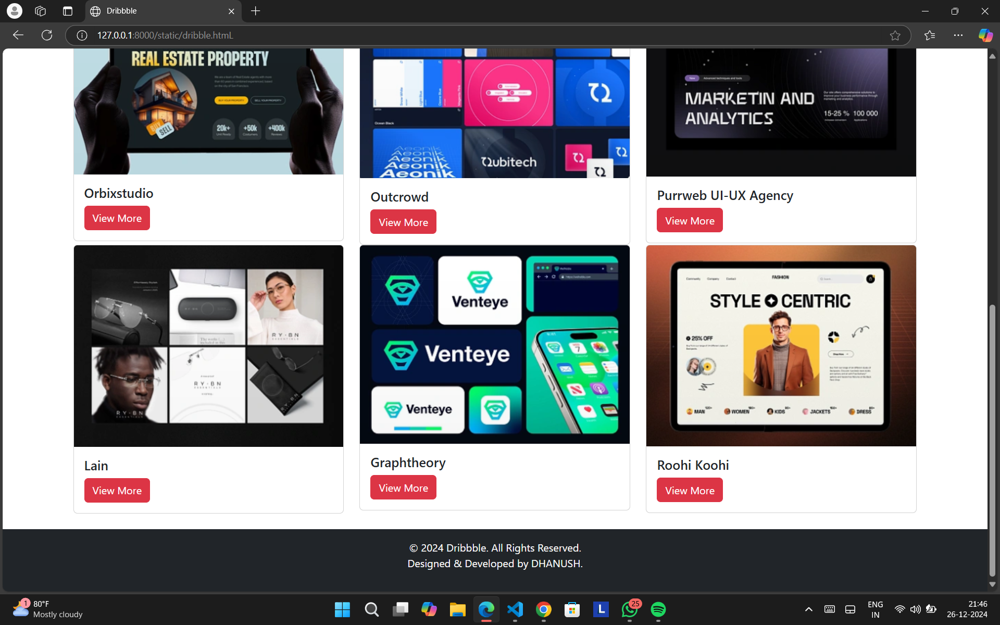

# Project Responsive Web Design using Bootstrap
## Date:26/12/2024

## AIM:
To create a simplified clone of Dribbble (https://dribbble.com/) landing page.


## DESIGN STEPS:

### Step 1:
Clone the repository from GitHub.

### Step 2:
Create Django Admin project.

### Step 3:
Create a New App under the Django Admin project.

### Step 4:
Insert the necessary CSS and JavaScript files as external in order to use Bootstrap.

### Step 5:
Create a HTML file and include the needed Bootstrap components.

### Step 6:
Publish the website in the LocalHost.

## PROGRAM :

```
<!DOCTYPE html>
<html lang="en">
<head>
    <meta charset="UTF-8">
    <meta name="viewport" content="width=device-width, initial-scale=1.0">
    <title>Dribbble</title>
    <link href="https://cdn.jsdelivr.net/npm/bootstrap@5.3.0/dist/css/bootstrap.min.css" rel="stylesheet">
</head>
<body>
    <header class="bg-dark text-white py-3">
        <div class="container text-center">
            <h1>Dribbble</h1>
            <p>Discover the world’s top designers & creatives</p>
        </div>
    </header>

    <main class="container my-4">
        <div class="row">
            
            <div class="col-md-4">
                <div class="card">
                    
                    <div class="card-body">
                        <h5 class="card-title">Emote</h5>
                        <a href="#" class="btn btn-danger">View More</a>
                    </div>
                </div>
            </div>

            
            <div class="col-md-4">
                <div class="card">
                    
                    <div class="card-body">
                        <h5 class="card-title">Fancy</h5>
                        <a href="#" class="btn btn-danger">View More</a>
                    </div>
                </div>
            </div>

            
            <div class="col-md-4">
                <div class="card">
                    
                    <div class="card-body">
                        <h5 class="card-title">Korsa</h5>
                        <a href="#" class="btn btn-danger">View More</a>
                    </div>
                </div>
            </div>

            <div class="col-md-4">
                <div class="card">
                    
                    <div class="card-body">
                        <h5 class="card-title">Orbixstudio</h5>
                        <a href="#" class="btn btn-danger">View More</a>
                    </div>
                </div>
            </div>

            <div class="col-md-4">
                <div class="card">
                    
                    <div class="card-body">
                        <h5 class="card-title">Outcrowd</h5>
                        <a href="#" class="btn btn-danger">View More</a>
                    </div>
                </div>
            </div>

            <div class="col-md-4">
                <div class="card">
                    
                    <div class="card-body">
                        <h5 class="card-title">Purrweb UI-UX Agency</h5>
                        <a href="#" class="btn btn-danger">View More</a>
                    </div>
                </div>
            </div>

            <div class="col-md-4">
                <div class="card">
                    
                    <div class="card-body">
                        <h5 class="card-title">Lain</h5>
                        <a href="#" class="btn btn-danger">View More</a>
                    </div>
                </div>
            </div>

            <div class="col-md-4">
                <div class="card">
                    
                    <div class="card-body">
                        <h5 class="card-title">Graphtheory</h5>
                        <a href="#" class="btn btn-danger">View More</a>
                    </div>
                </div>
            </div>

            <div class="col-md-4">
                <div class="card">
                    
                    <div class="card-body">
                        <h5 class="card-title">Roohi Koohi</h5>
                        <a href="#" class="btn btn-danger">View More</a>
                    </div>
                </div>
            </div>
        </div>
    </main>

    <footer class="bg-dark text-white text-center py-3">
        <p>&copy; 2024 Dribbble. All Rights Reserved.<br>
                   Designed & Developed by DHANUSH.</p>
    </footer>
</body>
</html>

```


## OUTPUT:


## RESULT:
The Project for responsive web design using Bootstrap is completed successfully.
